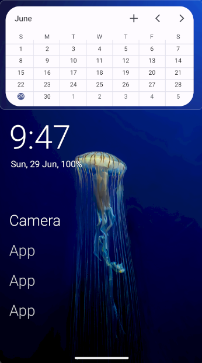
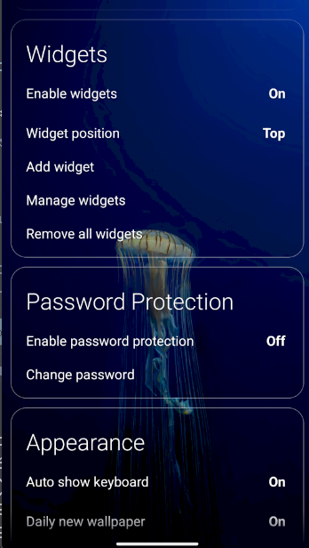
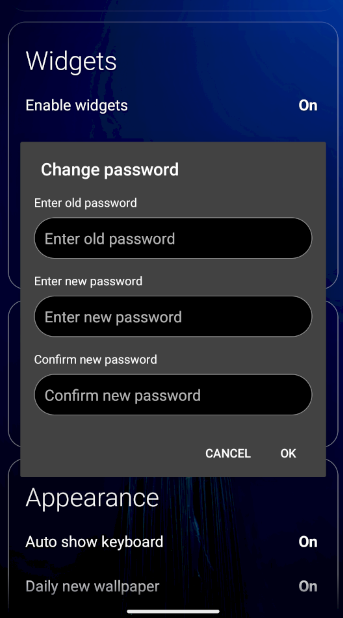

# Olauncher Enhanced | Minimal AF Launcher Fork

**This is a fork of the original [Olauncher](https://github.com/tanujnotes/Olauncher) with enhanced features including advanced widget support and password protection.**

AF stands for Ad-Free :D

## 📸 Screenshots

### **Home Screen with Widgets**


*Enhanced home screen showing resizable widgets with visual indicators*

### **Widget Management & Settings**


*Widget settings panel and management interface*

### **Advanced Features & Customization**


*Advanced customization options and enhanced features*

### **Widget Features**
- **Resize Handles**: Gray borders and diagonal lines in bottom-right corner
- **Move Indicators**: Blue borders during drag operations
- **Delete Options**: Red X indicators for widget removal
- **Smart Layout**: Widget area adapts to position setting

### **Password Protection**
- **Secure Access**: Password verification for hidden apps
- **Settings Integration**: Password protection controls in settings
- **Visual Security**: Clear indication of protected features

*Screenshots showcase the enhanced widget system, settings management, and advanced customization features.*

## 🎮 Enhanced Features

### 📱 **Advanced Widget System**
- **Resizable & Movable Widgets**: Drag to resize and move widgets anywhere on the home screen
- **Persistent Widget Sizes**: Widget sizes and positions are automatically saved and restored
- **Widget Position Control**: Choose widget area position (top, middle, bottom)
- **Individual Widget Management**: Long-press to delete specific widgets
- **Widget Hint System**: Visual indicators for resize handles and delete options
- **Smart Widget Layout**: Automatic layout adjustments based on widget count

### 🔐 **Password Protection for Secret Apps**
- **Secure Hidden Apps**: Password-protect access to hidden apps
- **SHA-256 Password Hashing**: Secure password storage with salt
- **Password Verification**: Required password verification for all sensitive operations
- **Change Password Security**: Old password required to change to new password
- **Disable Protection Security**: Password required to disable protection

### 🎨 **Enhanced UI/UX**
- **Visual Feedback**: Color-coded borders for resize (gray), move (blue), and delete (red) operations
- **Improved Widget Area**: Better spacing and layout management
- **Smart Visibility**: Widget hints show/hide based on widget presence
- **Touch-Friendly Controls**: Larger resize handles for easier interaction

## 📥 Install

#### Install from [F-Droid](https://f-droid.org/packages/app.olauncher) or [Play Store](https://play.google.com/store/apps/details?id=app.olauncher) for the original version, or build this enhanced fork from source.

[](https://f-droid.org/packages/app.olauncher)
[](https://play.google.com/store/apps/details?id=app.olauncher)

## 🔧 Building from Source

```bash
# Clone this enhanced fork
git clone https://github.com/housemateguy/Olauncher.git
cd Olauncher

# Build the APK
./gradlew assembleDebug

# Install on device
adb install app/build/outputs/apk/debug/app-debug.apk
```

## 📋 Widget Implementation Details

### **Core Components**
- `ResizableMovableLayout.kt`: Custom layout for resizable and movable widgets
- `WidgetSizeHelper.kt`: JSON-based widget size and position storage
- `WidgetHelper.kt`: Widget management and creation utilities
- Enhanced `HomeFragment.kt`: Widget area management and lifecycle

### **Features**
- **Automatic Size Persistence**: Widget dimensions saved as JSON
- **Position Memory**: Widget positions preserved across app restarts
- **Smart Cleanup**: Removed widgets don't leave orphaned data
- **Layout Adaptation**: Widget area adjusts based on position setting
- **Visual Indicators**: Clear feedback for resize, move, and delete operations

### **Usage**
1. **Add Widgets**: Long-press home screen → Add widget
2. **Resize**: Drag bottom-right corner to resize
3. **Move**: Drag anywhere else to move
4. **Delete**: Long-press widget to delete
5. **Position**: Settings → Widgets → Position (top/middle/bottom)

## 🔐 Password Protection Details

### **Security Features**
- **SHA-256 Hashing**: Passwords hashed with random salt
- **Verification Required**: All sensitive operations require password
- **Secure Storage**: Passwords stored in encrypted preferences
- **Session Management**: Automatic timeout for security

### **Usage**
1. **Enable Protection**: Settings → Password Protection → Enable
2. **Set Password**: Choose 4-20 character password
3. **Access Hidden Apps**: Enter password when accessing hidden apps
4. **Change Password**: Old password required for changes
5. **Disable Protection**: Password required to disable


## 📄 License

Original License: [GNU GPLv3](https://www.gnu.org/licenses/gpl-3.0.en.html)

## 🙏 Credits

- **Original Olauncher**: [@tanujnotes](https://github.com/tanujnotes) | [X/Twitter](https://twitter.com/tanujnotes) | [Bluesky](https://bsky.app/profile/tanujnotes.bsky.social)
- **Enhanced Features**: This fork adds advanced widget support and password protection

**[See original developer's other apps](https://play.google.com/store/apps/dev?id=7198807840081074933)**
